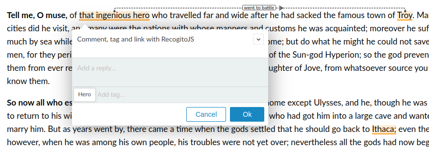

# RecogitoJS

A JavaScript library for text annotation. Add annotation functionality to any web page 
easily, or use it as a toolbox for building your own, completely custom annotation apps. 
RecogitoJS supports the [W3C Web Annotation](https://www.w3.org/TR/annotation-model/) 
standard.



## Resources

- [Introduction](https://github.com/recogito/recogito-js/wiki)
- [API Reference](https://github.com/recogito/recogito-js/wiki/Developer-Documentation)
- [Demo](https://recogito.github.io/recogito-js/)

## Installing

If you use npm, `npm install @recogito/recogito-js`. Otherwise download the 
[latest release](https://github.com/recogito/recogito-js/releases/latest).

```html
<script src="recogito-0.1.1.min.js"></script>
```

## Using

The example below shows how to make text annotate-able with just a few lines of JavaScript.

```html
<body>
  <pre id="my-content">My text to annotate.</pre>
  <script type="text/javascript">
    (function() {
      var r = Recogito.init({
        content: document.getElementById('my-content')
      });

      // Add an event handler  
      r.on('createAnnotation', function(annotation) { /** **/ });
    })();
  </script>
</body>
```

